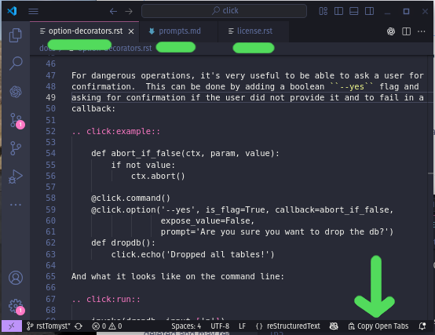

# Copy Open Tabs

A simple VS Code extension that lets you click a status‐bar button to copy all open tabs into your clipboard, each preceded by a relative‐path header.

## Features

- Status‐bar button with a clipboard icon  
- Computes path relative to first workspace folder (or filename if no workspace)  
- Concatenates all open editors in left‐to‐right order  
- Copies to system clipboard  

## Requirements

None beyond a workspace with open editors

## Extension Settings

This extension contributes no settings.

## Known Issues

- Only uses the first workspace folder for relative paths.  
- Does not include unsaved files with no path.

## Release Notes

### 0.0.1

- Initial release
